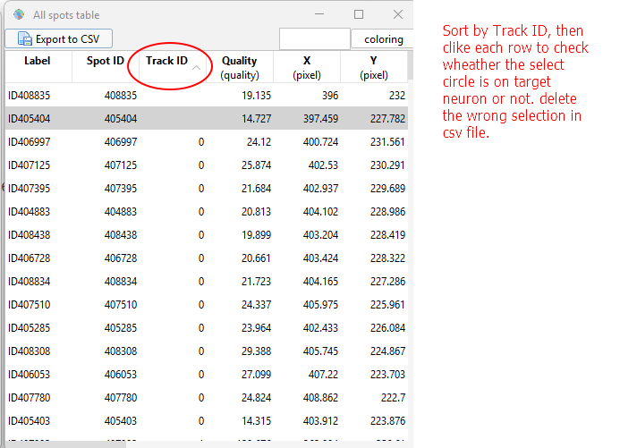

# Calcium Imaging data analysis on *Drosophila* larval thermal sensing neurons ##

## Table of Contents

- [Overview](#overview)
- [Requirements](#requirements)
- [Setup Instructions](#setup-instructions)
  - [1. Set Up a Python Virtual Environment](#1-set-up-a-python-virtual-environment)
  - [2. Install Required Packages](#2-install-required-packages)
  - [3. Clone or Download This Repository](#3-clone-or-download-this-repository)
- [Input File Organization](#input-file-organization)
- [Workflow](#workflow)
  - [Step 1: Visualizing Neuron Response in ImageJ](#step-1-visualizing-neuron-response-in-imagej)
  - [Step 2: Extracting Fluorescence Intensity Using TrackMate](#step-2-extracting-fluorescence-intensity-using-trackmate)
  - [Step 3: Background Correction](#step-3-background-correction)
  - [Step 4: Clean the Exported CSV File](#step-4-clean-the-exported-csv-file)
  - [Step 5: Work on Additional Z-stacks](#step-5-work-on-additional-z-stacks)
  - [Step 6: Checklist Before Running Python](#step-6-checklist-before-running-python)
  - [Step 7: Calculate ΔF/Fmin](#step-7-calculate-Δf/fmin)
  - [Step 8: Align Calcium Signal with Temperature](#step-8-align-calcium-signal-with-temperature)
  - [Step 9: Summary Calcium reponses Across Samples](#step-9-summary-calcium-responses-across-samples)

## Overview 

This repository provides Python scripts and a complete data analysis pipeline for 3D calcium imaging of thermosensory neurons in *Drosophila* larvae. Designed as an instructional resource, the pipeline offers step-by-step guidance to analyze real calcium imaging datasets with minimal coding experience.

This pipeline is used to:

- Extract neuron fluorescence intensities from Z-stack TIFFs using TrackMate in Fiji/ImageJ.

- Performing background correction, and running quantitative analysis to calculate ΔF/Fmin across time.

- Align calcium activity with temperature profiles.

- Visualize average responses.

✅ No prior programming experience is required 

## Requirements
To complete the analysis following softwares are required:

### ImageJ (Fiji): (https://imagej.net/software/fiji/)

### Python 3.6+: (https://www.python.org/)

Install the Python packages using `pip`:

- `pandas`
- `numpy`
- `matplotlib`

```bash
Pip install –r requirements.txt
```

## Setup Instructions

Setup your Python environment using either a terminal or an IDE like PyCharm.

- Terminal Setup

```bash
# Create a virtual environment
python -m venv calcium_env
```

```bash
# Active the environment for nmacOS/Linux:
source calcium_env/bin/activate    

```bash
# Active the environment for Windows:
calcium_env\Scripts\activate       
```
- Pycharm Setup

  - Open PyCharm → **New Project**

  - Select **New environment using venv**

  - Set the folder name (e.g., calcium_env)

  - Click Create to generate the environment

✅ Once your environment is ready, install the required Python packages.

## 2. Install Required Packages

```bash
pip install -r requirements.txt
```
This will install essential packages like pandas, numpy, and matplotlib.

## 3. Clone or Download This Repository 

Clone or download this repository into the same directory as your virtual environment or your PyCharm project folder.

- Clone with Git

```bash
git clone https://github.com/<your-username>/<your-repo-name>.git 
```

- Download ZIP

  - Click the green "Code" button on this GitHub page

  - Select "Download ZIP"

  - Unzip the folder into your calcium_env (or PyCharm project) directory

✅ Once the repository is in place, you're ready to begin with Step 1: Visualizing Neuron Response in ImageJ

## Download Demo data
You can download a complete set of demo data to test the analysis pipeline:

🔗 [Google Drive:](https://drive.google.com/drive/folders/1SJ6MvMnjAEGj97EMcBNw9BtBAGIzd_ie?usp=sharing)

### Contents
- Warm Cell Calcium Imaging Dataset (TrackMate) 
  🔗 [Download from Google Drive](https://drive.google.com/drive/folders/1jOz49KPs6MrifaxbZA1E5XVw5MqSgAFq?usp=drive_link)  
  A recorded calcium imaging dataset from warm cells, used for practicing fluorescence extraction using **TrackMate**.

- Analysis Folder ('CIAnalysis_120s.py') 
  🔗 [Download from Google Drive](https://drive.google.com/drive/folders/1jOz49KPs6MrifaxbZA1E5XVw5MqSgAFq?usp=drive_link)  
  A pre-configured `Analysis/` directory including `Neuron 0`, `Neuron 1`, and background files which is ready for testing `CIAnalysis_120s.py`.

- Temperature-Aligned Demo ('CITbind_dynamic.py') 
  🔗 [Download from Google Drive](https://drive.google.com/drive/folders/1Os7cZcNqwWUiyfrDLTFGgrDq9NQP3Y_W?usp=drive_link)  
  A sample set for running `CITbind_dynamic.py`, including calcium traces with temperature logs.

- Summary Demo ('df_temp_class.py') 
  🔗 [Download from Google Drive](https://drive.google.com/drive/folders/1GgIKlhk0pE3DFm2LLXnqHcBZ7ylPUorC?usp=drive_link)  
  A demo dataset for testing `df_temp_class.py`, which summarizes group-level calcium responses.

✅ Use these datasets to follow the full analysis workflow without needing your own experimental data.

## DOWC_demo file structure

Before starting the analysis, unzip <DOWC_demo> and make sure the files and folder structure match the following:

<pre> ```

project/
│
├── MAX_Samplexxx.tif            # Maximum projection TIFF for initial visualization
├── Analog - <timestamp>.csv      # Temperature log recorded during imaging
├── Samplexxx_stacks/           # 21 z-slice TIFFs (Z01 to Z21), each with 88 time points
│   ├── Z01.tif
│   └── ...
├── Analysis/       # empty folder with correct file structure 
     ├── background_i.xlsx       
     ├── Neuron 0/   
     └── Neuron 1/    
``` </pre>

⚠️ Notes: Keep file names and folder structure exactly as recommended. The analysis scripts rely on this structure to locate and process data correctly. Incorrect naming or layout will likely result in file-not-found or parsing errors during execution.             

## Workflow

### Step1: Visualizing Neuron Response in ImageJ

Start the analysis by loading the **maximum projection image** into Fiji (ImageJ). This image helps you quickly access:

- overall fluorescence intensity
- neuron number, shape, and locations
- movement artifacts 
  
It serves as a first-hand visual screen for movement artifacts before conducting in-depth individual z-stack analysis.<br>

Adding annotations and screenshots is strongly recommended. It helps track neuron position for later individual z-slice analysis.<br>


⚠️ Large movement prevents TrackMate tracking, and manual extraction of intensity values will be necessary.

### Loading the Image in Fiji

- Launch Fiji (ImageJ)

- Drag and drop MAX_DOWC001.tif into the Fiji window, or use File → Open... and select MAX_DOWC001.tif.

- Use the slider at the bottom to scroll through time frames.  

- Adjust brightness Use Brightness/Contrast or Ctrl + Shift + C on windows Command + Shift + C on macOS.<br>

<p align="center">
  
</p>

## Step 2: Extracting Fluorescence Intensity Using TrackMate

This step use TrackMate in Fiji to extract fluorescence intensity over time for each neuron from selected z-stack TIFFs. We will use Neuron 0 as example to demonstrate z-stack analysis. 

### 1. Start with the brightest z-stack in Fiji

- Go to ‘SampleXXX_stack/’ (e.g. DOWC_demp/DOWC001_stack) folder and open a mid-plane TIFF (e.g. DOWC_demp/DOWC001_stack/DOWC_Z10.tif)

- Adjust brightness/contrast to see cells clear.

- Find a strong response time point (e.g. t=42 in demo sample)

- Open neighboring z-stacks at t=42 and compare fluorescence brightness.

- Select the strongest slice to start the analysis

  - For example:
    - Neuron 0, start the analysis on ##_z08.tif
    - Neuron 1, start the analysis on ##_z10.tiff<br>

<br>

### 2. Lauch TrackMate for Neuron 0

- Open DOWC001_Z08.tif in Fiji

- Go to Plugin/Tracking/TrackMate.

- When prompted with 'Z/T swapped?', click 'Yes'.<br>

<br>

<br>

### 3. Configure Detection Settings in TrackMate

- Detector: Select 'DoG (Difference of Gaussian)'


- Estimated object diameter: 22–36 pixels (based on neuron size)

- Quality threshold: Start with 1.0 (reduce if needed)

- Enable:
  - Sub-pixel localization
  - Pre-process with median filter

- Click Preview to confirm that the detection (purple circle) fits the neuron correctly.<br>


### 4. Apply Spot Filters

- Use 'Set filters on spots' to remove irrelevant signals

- Filter by 'X/Y position' to isolate Neuron 0.

- Use 'Preview' to ensure only the correct neuron is selected.<br>

<br>

- Select 'Simple LAP tracker' with following settings.<br>

<br>

<br>

### 5. Export Intensity Data

- Click 'Sports' to acquire 'All spots table' <br>

<br>

- Sort 'All spots data' by clicking 'Track ID' <br>

<br>

- Click 'Export to CSV' to save the file into Analysis/Neuron 0/Mean_Intensity08.csv.

### 6. Clean the Exported CSV file

⚠️ Notes: Accurate cleaning at this stage is essential for proper ΔF/Fmin calculation and downstream analysis in Python.

- Open the Mean_Intensity08.csv, remove extra headers

- Manually check each row. Use  'Track ID' and visualize same ID image in 'All sport table' in Trackmate. Remove any incorrect or off-target tracks in csv file. 

- Sort the file by 'POSITION_T'. 

- Delete duplicates. 

- Save the cleaned csv.

## Step 3: Background Correction

Before calculating ΔF/Fmin, five background fluorescence data must be recorded for each Z-stack used in analysis.

### 1. Open `background_i.xlsx` located in `Analysis/` folder.<br>

<br> 

### 2. Measure Background Fluorescence in Fiji

- Go to t=12,24,36,48,60.

- Hold shift and press the Oval tool in Fiji

- Draw ‘circular ROI’ on a background area close to target neuron using the same diameter as neuron cell. 

- Press M to obtain the intensity value

- Record five background values at t=12,24,36,48,60 into the corresponding column of `background_i.xlsx`.<br>

<br> 

- Copy and paste to background_i.xlsx.<br>

<br> 


⚠️ Notes: The number of background values recorded must exactly match the number of Mean_Intensity##.csv files for each neuron.<br>
For example, if Neuron 0 has cleaned data from Z05 to Z11, there should be seven sets of five background values for Neuron 0 in background_i.xlsx.

## Step 5: Repeat the TrackMate analysis on all other stacks which you can see the target neuron across all times.

## Step 6: Checklist Before Running Python

Make sure the following are true before running the analysis script:

- All extra headers are removed from every Mean_Intensity##.csv file

- No duplicate POSITION_T values exist in any Mean_Intensity##.csv

- background_i.xlsx contains a matching number of rows for each neuron's Z-slice .csv files

- Inconsistencies here will result in Python script errors or inaccurate ΔF/Fmin values.

## Step 7: Run `CIAanalysis_120s.py` to Calculate ΔF/Fmin

Once all intensity files and background data are prepared and validated, use the Python script 'CIAanalysis_120s.py' to compute 'ΔF/Fmin' for each neuron and generate visual outputs.

### 1. Open terminal or Pycharm

Navigate to the project directory and activate your Python environment (if applicable).

### 2. Command

Run the following command from terminal or within PyCharm terminal:

```bash
python CIAnalysis_120s.py -i path/to/Analysis --merge --cell_type DOWC
```
- Script arguments

  - -i: Path to the Analysis/ folder

  - --merge: (optional) Combines results from all neurons into a summary

  - --cell_type: Adds a label (e.g., DOWC, DOCC) to outputs for reference

### 3. Input Files before running CIAanalysis_120s.py

<pre> ```
project/
└── Analysis/        # CIAanalysis_120min.py input
    ├── background_i.xlsx       
    ├── Neuron 0/
    │   ├── Mean_Intensity##.csv      # file name should following the naming 
    │   └── ...
    └── Neuron 1/
        ├── Mean_Intensity##.csv      # file name should following the naming 
        └── ...
``` </pre>  

### 4. Output Files after running CIAanalysis_120s.py

After the script finishes, you will find the results in the following structure:

<pre> ```
project/
└── Analysis/        #  CIAanalysis_120min.py input 
    ├── background_i.xlsx
    ├── background_list.csv             
    ├── Neuron 0/
    │   ├── Mean_Intensity##.csv      # file name should following the naming 
    │   └── ...
    ├── Neuron 1/
    │   ├── Mean_Intensity##.csv      # file name should following the naming 
    │   └── ...
    └── results/       # generated results folder
        ├──Neuron 0.csv       # ΔF/Fmin trace for Neuron 0
        ├──Neuron 1.csv
        ├──Neuron Plots/
        │  ├──Neuron 0.png       # plot for neuron 0
        │  └── Neuron 1.png
        └──Merged_data/
           ├──merged_data.csv       # Combined ΔF/Fmin data
           └── Average_dF.png
  
``` </pre>

## Step 8: Run `CITbind_dynamic.py`

This step integrate the calcium activity (ΔF/Fmin) with the temperature log file collected during imaging. <br>
It generates a dual-axis plot that visualizes neuronal responses alongside temperature fluctuations over time.<br>

### 1. Input Files before running the command

Create a new folder named SampleXXX_date (e.g. DOWC001_20240820) 

Copy and paste in merged_data.csv from Analysis/results/merged_data.csv and temperature log

<pre> ```
project/ 
└──SampleXXX_date/        #  
    ├── merged_data.csv
    └── Analog - <timestamp>.csv
``` </pre>
      
### 2. Command 

Run the following command in your terminal or PyCharm:

```bash
python CITbind_dynamic.py -i path/to/SampleXXX_date -n
```

- Arguments

  - -i: Path to the folder that contains:

    - merged_data.csv

    - the corresponding temperature log file (e.g., Analog - 8-20-2024.csv)

  - -n: Number of neurons analyzed (i.e., number of individual neuron .csv files)

### 3. Output Files after running the command

- The script will generate:

  - Overlaid plot of ΔF/Fmin and temperature vs. time

  - CSV file combining temperature and calcium signal data

<pre> ```
└──SampleXXX_date/          
    ├── SampleXXX_date.csv
    ├── SampleXXX_date_cbind.csv
    ├── SampleXXX_date_temp.csv
    ├── SampleXXX_date_cbind0.pdf
    └── SampleXXX_date_cbind1.pdf
``` </pre>

After run the script you will get the results for the current sample. Then continue to work on all other samples and sumarize all the results into csv files. <br>

## Step 9: Average Calcium Signals Across Samples Using df_temp_class.py

This step computes the average ΔF/Fmin trace and generates group-level plots across multiple samples or neurons. This is useful for comparing replicates or summarizing class-wide data.

### 1. Required Input Files

- Create a new folder named ‘summary’
- Copy two files to 'summary' folder:
  - Summary_df.csv — calcium traces from all neurons
  - Summary_temperature.csv — corresponding temperature data for each sample

- Make sure:
  - 'Summary_df.csv': the first column name is Temperature, then continue with n1, n2, ... 
  - 'Summary_temperature.csv':The first column name is Temperature, then continue with t1, t2, ... 

### 2. Command
Run the following command in your terminal or PyCharm:

```bash
python df_temp_class.py path/summary_df.csv path/summary_temperature.csv
```

### 3. Output

- The script will generate:

  - Summary plot of the group average ΔF/Fmin trace with SEM (error bars)

  - Average trace CSV summarizing ΔF/Fmin values across all neurons

